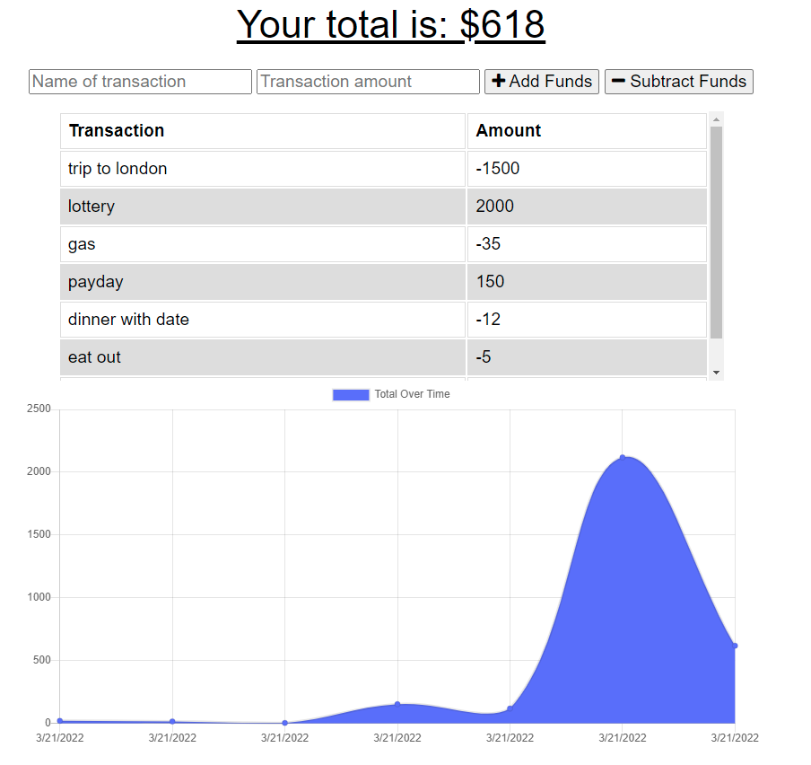

# Track My Money

## Description
Track My Money is an application that can make transactions whether off or on line

## Link
https://cjthom98.github.io/track-my-money/

Better to install and run on local host

## Installation
* Clone repo or download zip
* Run an npm init
* Install Mongoose, Express, JQuery, BootStrap, and Popper.js
* Install dependencies webpack, webpack-cli, webpack-bundle-analyzer, file-loader, image-webpack-loader, webpack-dev-server
* Run npm start and open browser and search localhost:3001

## Technologies
* Javascript
* JSON
* Mongoose
* PWA Webpacks
* IndexedDB

## Issues
* Unable to create a heroku link due to terminal unable to recognize term "heroku"
* However, was able to run site on local host

## License

## Author

Cory Thompson